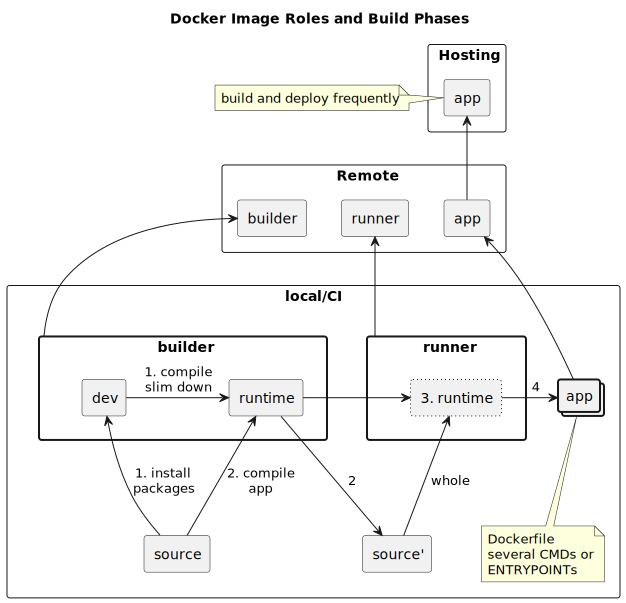

## 効率的にメンテできるマルチ言語ランタイムのDockerイメージを目指して

### 基本的な考え方

Cloud Native Buildpacks の考え方に倣いつつ、

 * builder image
 * runner image

を明確に分離、runner から生成して実際にサーバ上で動作する

 * app image

を加えて 3種類の image を管理する。その際、

 * base image を更新しやすくするために Dockerfile の外からパラメータを与える
 * そのパラメータを持ち、何回も実行するために sh script を用意

してある。sh script は以下の4種類。

 * builder image を docker build する
 * builder image を利用して app を compile する
 * runner image を build する
 * runner image に app コードをコピーして実行可能な image を作る

※ 本当は docker push と deploy も必要だが、現時点ではそれは含んでいない

### 概念図

### 気をつけたこと

 * app image が世界、インターネットとの接点であり、app image を頻繁に build すること、app image の base になる runner image を頻繁に build[^1] することが重要なので、runner image の build がローコストに実現できること
 * Dockerfile 内で base image に利用している OS の知識を必要以上に要求しない
 * Dockerfile に備わっている機能、docker build や docker run に備わっている機能に素直に従う
 * 開発環境のコードの配置をそのまま利用して Docker 環境、CI/CD 環境で各種 image を作りやすいこと

### サンプル構成

 * Sinatra 4
 * Vite 5

を組み合わせた Web アプリ（のフリをしたただの Hello, World）と HTTP リクエストを受け付けない console アプリ（の、フリry

その下はあえてちょっと古めにしてある。

 * Ruby 3.1.2
 * Node.js 18.20
 * PostgreSQL 14[^2]

[^1]: もちろんその base image を pull したうえで
[^2]: 実際には使ってないが、builder と runner で必要な準備が違うことが分かるように入れてある

### 参考

 * [What is a builder? · Cloud Native Buildpacks](https://buildpacks.io/docs/for-app-developers/concepts/builder/)
 * [マルチステージ ビルドを使う — Docker\-docs\-ja 24\.0 ドキュメント](https://docs.docker.jp/develop/develop-images/multistage-build.html)
 * [Advanced ARG and ENV Dockerfile tricks \| by Dubo Dubon Duponey \| Medium](https://dubo-dubon-duponey.medium.com/advanced-arg-and-env-dockerfile-tricks-6b1eae68d02a)
